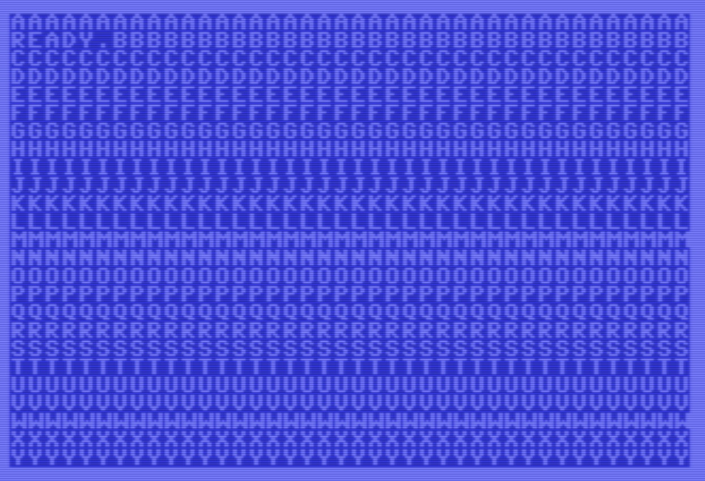

# c64-assembly-demo

## Setup

### Clone and build the compiler (Assembler)

```shell
git clone https://github.com/cc65/cc65.git
cd cc65
make

## verify by running
bin/ca65

## you should get something like "ca65: No input files"
```

### Install VICE (Emulator)

```shell
brew install vice

# verify by running
x64sc
```

When missing kernal and other ROMS, copy files from rom subfulder to `/usr/lib/vice/C64/`.

### (Optional) Install VSCode extension

`ca65 Macro Assembler Language Support`

## Resources

[6502 Opcodes](http://www.6502.org/tutorials/6502opcodes.html)

[CA65 Assembly Docs](https://cc65.github.io/doc/ca65.html)

[C64 Memory Map](https://www.c64-wiki.com/wiki/Memory_Map)

[PETSCII Charset](https://sta.c64.org/cbm64pet.html)

[C64 Kernal Functions](https://sta.c64.org/cbm64krnfunc.html)

## Getting started

1. Go to `src` folder
2. Execute `make run` in terminal
3. The simulator should start running a program that show `A` in the top-left corner of the screen

## Goal

Fill the screen line by line with letters in the following pattern:
First line will be fully filled by letter `A`, second with `B`, etc.

This is what the success looks like: 

### Hints

#### Variables

To create a variable, reserve space in memory using the following syntax:

```asm
.zeropage   ; places this segment of code in the zero page memory segment
variable-name:
    .res 2  ; reserves two bytes that where the first byte is represented by the `variable-name`

.segment "CODE"
    ... your code goes here ...
```

#### Includes

There is a cool "header" file in the `cc65/lib/c64.inc`, check it out as it gives a lot of nice variables to be used instead of magic numbers.

```asm
.include "c64.inc"
```
